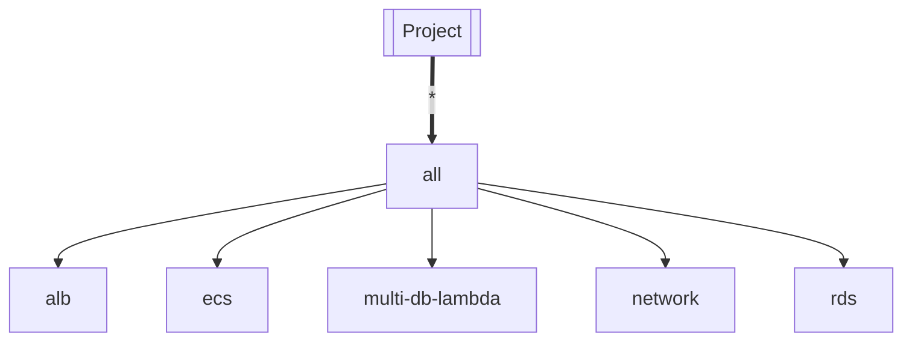
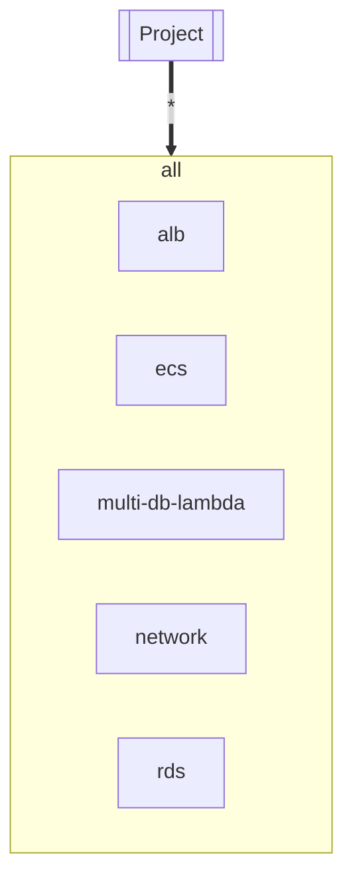

# Shared Resources

The Incubator environment includes
a number of resources shared between incubated projects.
For instance, there's a network configuration,
and a shared RDS database server instance.

## How it is Now

The current arrangement is the result
of using Terragrunt.
Without getting to deep into things,
the way Terragrunt manages related modules
leaves them all singleton and unrelated.
Until the migration from Terragrunt is complete,
we'll need to maintain something like that.

Here's how it looks today:


Each box above is a separate, deployable module.
The "Project" box is any incubated project.
The rest of the boxes shouldn't need to be deployed often.

The **all** box doesn't actually (yet)
specify any infrastructure resources itself.
Instead,
it collects and re-exports output values from the other modules.
For instance:
```terraform
output "alb_external_dns" {
  value = data.terraform_remote_state.shared["alb"].outputs.lb_dns_name
}
```

This lets the projects refer only to the `all` module
and be able to use the ALB and networks and DB IP addresses etc
as they're deployed.

The one downside to this arrangement
is that if one of the "real" shared modules
(e.g. `network`)
needs to be updated and re-deployed
the the `all` module must also be re-deployed.

# If you skipped all that, stop and read this:

> [!IMPORTANT]
> Whenever a shared resource module is updated and applied the `all` module must also be applied.

## How It Should be in the Utopian Future

Once the Terragrunt migration is complete,
the the `terraform-incubator` directory
replaces the existing `incubator` directory,
we should bundle up the smaller modules
into the `all` module.
This will do away with the "extra" step above
when making infrastructure changes.

The goal state looks like:


Updates to the sub-modules of the `all` shared resources
would then call for a single deploy of the `all`
module.
That is,
if you needed to make changes to `network`,
that would call for a `terraform apply` for `shared_resources/all`.

Before we can get there, however,
we'll need to merge the states of those modules.
There is a
[Hashicorp guide](https://support.hashicorp.com/hc/en-us/articles/4418624552339-How-to-Merge-State-Files)
to this process,
which should be reviewed and worked as a team.
We may also want to consider
[this tool](https://github.com/magodo/tfmerge)
